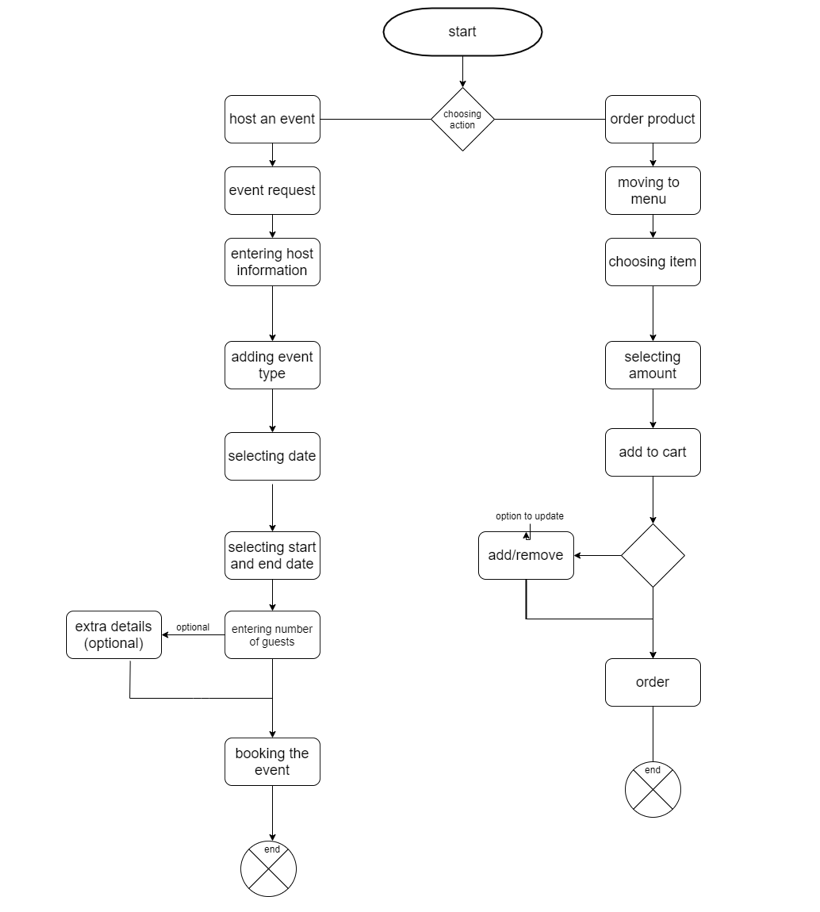

# Coffee-Land

***Together We Redefine Coffee*** is our goal , here in coffee land we are proud to serve the best quality coffee, from hot coffee to cold coffee.
what? you only want the coffee beans? do not worry , we got you covered , we provide the finest coffee beans for our clients.
you want a snack with your coffee? we got you.

## problem domain : 

our name is coffee addicts , and thats what we love... ***COFFEE!!!*** so we wanted a website to allow people to order coffee from home , or to be able to book a whole event online , it will give us the ability to serve more clients in very short time.

and thats where we coffee addicts come , we build a website ready to serve the clients with : 
+ modern features to attract the users attention 
+ user friendly menu and orderings 
+ ability to host an event in the cafe , with exact details to be taken , our cafe is ready to host any event with best performance and meeting the host(s) and the guests expectations and more.

## tools 

in our website we used the best tools to guarantee the best results, Visual Studio Code , Github and Ubuntu.

### wireframe built to be the blueprint of our work : 

.jpg)
.jpg)
.jpg)
.jpg)
.jpg)

### an activity diagram showing how our website works and how the client can use it : 

